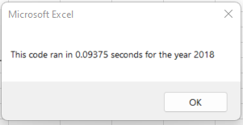

# Stock-Analysis

## Overview of Project

Steve would like to do a deeper dive into the analysis of stocks for his parents.  Since Steve is looking at multiple years, he needs a program that will allow him to look at all stocks during different years.  Steve is interested in the stock title, total volume and the return, so he can better guide his parents on their investment journey.  Steve would also like for the data to run smoothly and as fast as possible, so he can get back to his clients as soon as possible.  

## Analysis

**The Code**

With the code that was given, we were assigned to edit (refactor) the code to work for the given data.  In order to get the new code, I had to create an index, create the three output arrays and make sure that for each loop, the ticker volume started at zero.  

Then I needed to make sure that the code was running through all the lines of the spreadsheet, for the given year, to pull the information: adding up the total daily volume, determining the starting and ending tickers to then calculate the percent of return.

Once all of this data was gathered, it needed to be placed on the "All Stocks Analysis" sheet, within the document.  To do this, I needed to tell the code to drop the data on that sheet by activating it. The code already had the formatting in place.  

**The Comparison**

In 2017, there was only one stock (TERP) that did not have a successful return.  

In 2018, only two stocks had a successful return; ENPH and RUN.  

Steve should recommend to his parents to start with only investing in ENPH and RUN.  Eventhough DQ had an amazing return in 2017, with an almost 200% return, in 2018 it was down almost 63%.  

## Results

-  What are the advantages or disadvantages of refactoring code?

The advantages would be that you have a starting point of working code to use.  This is very helpful for someone like me, who is very new to coding.  The disadvantage would be figuring out how to rework the code to fit your data.  This was a little challenging to me at first, but after the two virtual classes I was able to work out my error and bugs in the code and get it to run properly.  

- How do these pros and cons apply to refactoring the original VBA script?

Having a starting point that I could use in the code from the module helped me understand the pieces that I needed to complete.  Also, having the descriptions in place, so I knew what I was doing in each step was incredibly helpful.  After going through the two virtual classes, I was able to see where I made some mistakes, when I was working through the challenge on my own.  From this, I was able to fix them and continue working.  

The most frustrating part of refactoring the original script was that I didn't pay close enough attention to labels.  There were two parts where I stated the variable as a plural, but then typed it out later as singular.  This error took me a long time to figure out, but it was eventually fixed.  The last con that I faced was remember to go back and fix my button to run the refactored macro, and not the original one.  
